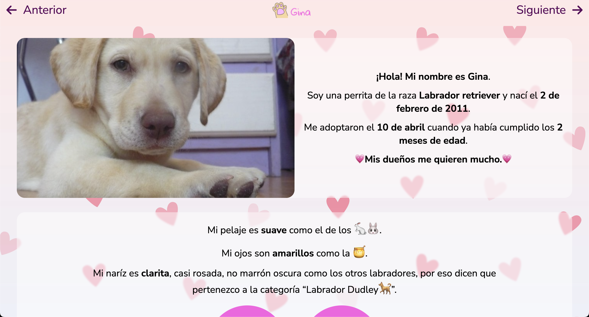
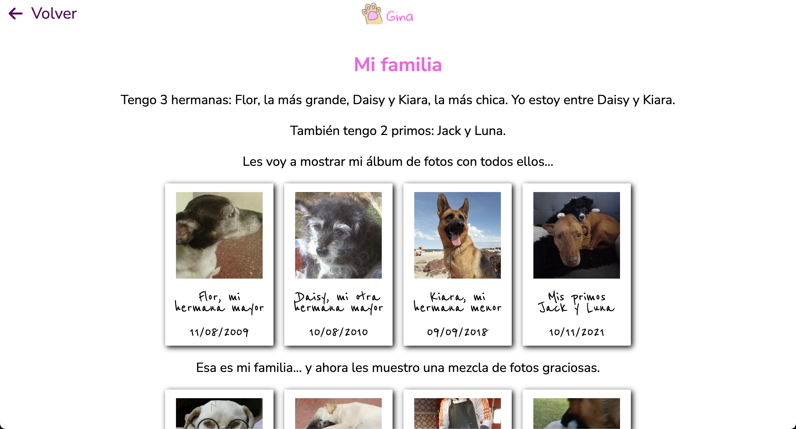
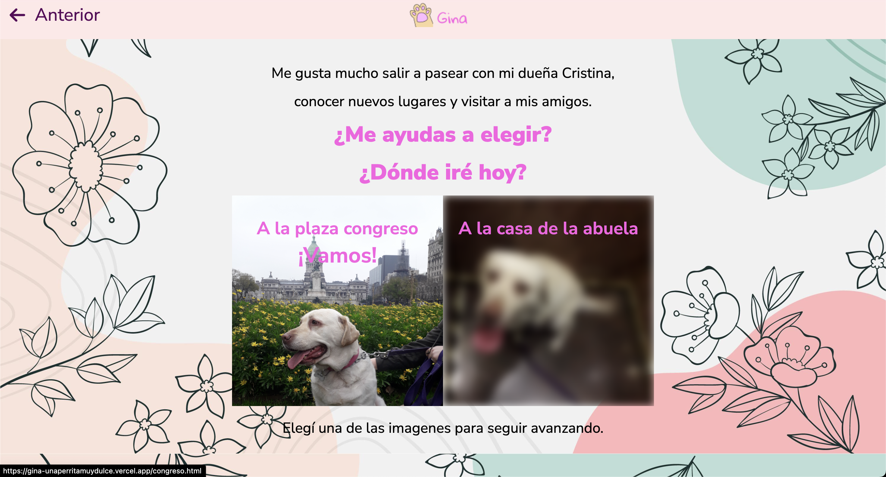
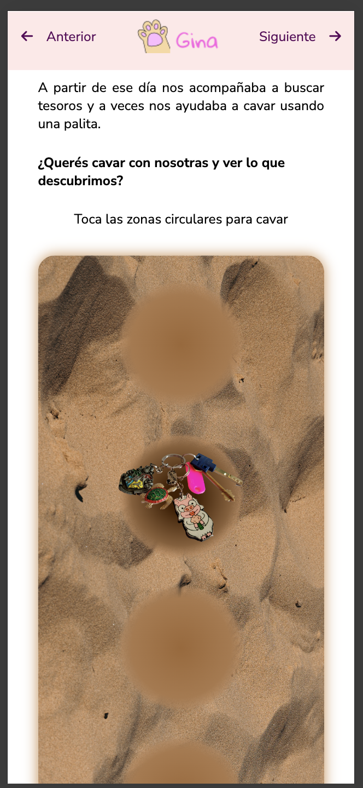

## GINA - Una perrita muy dulce y tierna - cuento digital
- **Last update:** 7 de agosto de 2022.
- **Link del proyecto:** [Gina - Cuento digital](https://gina-unaperritamuydulce.vercel.app/)

### Descripcion
- **Gina** es un cuento digital que narra la historia de una perrita muy dulce y tierna. Este proyecto fue realizado con el fin de practicar mis habilidades en HTML y CSS junto con la autora del cuento, **Cristina Tonina**. Es una historia donde se puede elegir el camino que se desea seguir junto con actividades interactivas.

### Tecnologias
- HTML
- CSS

### Capturas

## Autor
- [Natalia Vega](https://www.linkedin.com/in/nataliacamilavega/)
